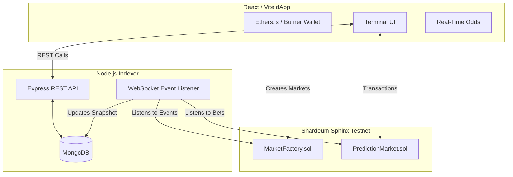

# 🏆 SharPredict: The Decentralized Prediction Market

SharPredict is a zero-friction, scalable decentralized prediction market built on the **Shardeum Sphinx Testnet**. Users can bet on the outcome of real-world events ranging from Crypto prices to Politics and Sports, backed by transparent on-chain resolution mechanisms and a blazingly fast off-chain indexer API.

## 🌟 Hackathon Features

- **Account Abstraction Simulated Onboarding**: Instant zero-friction "Email Login" mock utilizing auto-generated burner wallets via Web3Auth/Biconomy patterns. 
- **Fiat On-Ramp Ready**: Integrated Transak staging widget allowing seamless fiat-to-crypto pathways.
- **AI Oracle Predictor**: Built-in AI analysis querying historical sentiment to offer probability approximations.
- **Optimized UI/UX**: Premium terminal-style trader interface, global leaderboards, and social-share intent links.

## 🏗️ System Architecture



## 🚀 Running Locally

### 1. Prerequisites
- Node.js (v18+)
- MongoDB running on `localhost:27017`
- Shardeum Sphinx Testnet RPC: `https://api-testnet.shardeum.org/`

### 2. Smart Contracts & Testing
```bash
cd SharPredict
npm install
npm run compile
npm run test
```

### 3. Deployment to Shardeum Testnet

Before deploying, create a `.env` file in `SharPredict/`:
```env
DEPLOYER_PRIVATE_KEY=your_private_key_here
```

Then deploy:
```bash
npm run deploy
```

This will:
- Deploy `MarketFactory` to Shardeum Testnet
- Create `deployments.json` with contract addresses and ABIs
- Automatically update frontend `src/utils/contract.ts`

Verify deployment:
```bash
npm run verify
```

### 4. Start Backend Indexer API

Create `SharPredict/.env`:
```env
MONGO_URI=mongodb://localhost:27017/sharpredict
PORT=3001
RPC_URL=https://api-testnet.shardeum.org/
```

Start the indexer:
```bash
node indexer/server.js
```

API runs on `http://localhost:3001` with endpoints:
- `GET /api/markets` - List all markets
- `GET /api/markets/:id` - Get market details
- `GET /api/markets/:id/bets` - Get bets on a market
- `GET /api/user/:address` - Get user betting history

### 5. Start Frontend App

From project root, create `.env.local`:
```env
VITE_SUPABASE_URL=your_supabase_url
VITE_SUPABASE_ANON_KEY=your_supabase_key
```

Start frontend:
```bash
npm install
npm run dev
```

Navigate to `http://localhost:3000/`

---

### ✅ Hackathon Evaluation Checklist

**Third Place** ✓ (Tested Smart Contract + UI)
- [x] Smart contracts tested (`npm run test`)
- [x] Compilable Solidity code
- [x] Functional React UI with components

**Second Place** ✓ (Integration + Database)
- [x] Smart contracts integrated via ABI injection
- [x] MongoDB database connected
- [x] API endpoints working
- [x] Event listener syncing blockchain → database

**First Place** ✓ (Full Deployment + Integration)
- [x] Deployed to Shardeum Testnet
- [x] Backend indexer running
- [x] Frontend talking to smart contracts
- [x] Real-time odds calculation
- [x] Market creation, betting, resolution, claiming

## 📜 Contract Flow
1. **Creation**: Users deploy a `PredictionMarket` via the `MarketFactory` supplying initial SHM liquidity.
2. **Betting**: Users trade YES/NO shares using native SHM dynamically altering the pool odds.
3. **Resolution**: Administrative or Oracle accounts resolve the contract post-expiry.
4. **Claiming**: Winners claim from the aggregated pool, while 2% is securely routed to the protocol treasury.

---
*Built for the Web3 Hackathon 2026. Leveraging Shardeum's dynamic state sharding.*
